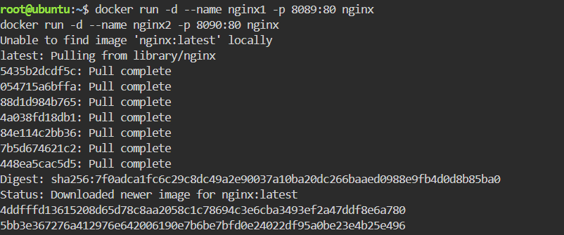
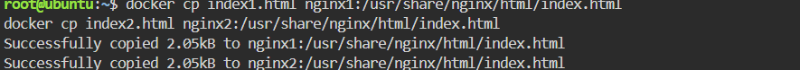
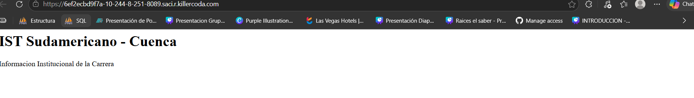

# Informe de Práctica: Servidor Web con Docker

### 1. Título
Despliegue y personalización de servidores web Nginx mediante contenedores Docker.

### 2. Tiempo de duración
45 minutos.

### 3. Fundamentos:
Como estudiante de desarrollo de software, entiendo que Docker es una plataforma que permite automatizar el despliegue de aplicaciones dentro de contenedores. A diferencia de las máquinas virtuales, los contenedores son mucho más livianos porque comparten el kernel del sistema operativo anfitrión, evitándonos la carga de un SO completo por cada instancia.

En esta práctica utilizamos **Nginx**, un servidor web de alto rendimiento. Gracias a Docker, podemos levantar múltiples instancias de Nginx en una sola máquina física de forma aislada, asignando puertos específicos (8089 y 8090) para evitar conflictos y asegurar que cada servicio funcione de manera independiente.

### 4. Conocimientos previos.
Para realizar esta práctica con éxito, fue necesario aplicar conocimientos en:
* Comandos básicos de la terminal de Linux.
* Gestión de puertos y protocolos de red.
* Uso de comandos de Docker (run, cp, ps).
* Administración de repositorios en GitHub.

### 5. Objetivos a alcanzar
* Implementar contenedores con Nginx de forma independiente y eficiente.
* Manipular archivos dentro de los contenedores usando el comando `docker cp`.
* Personalizar el contenido web para diferenciar información institucional y personal.

### 6. Equipo necesario:
* Computadora con sistema operativo Windows.
* Cuenta activa en GitHub.
* Entorno de laboratorio Killercoda (Docker Playground).
* Navegador web Google Chrome.

### 7. Material de apoyo.
* Guía de la asignatura de Tendencias Actuales de Programación.
* Documentación oficial de Docker.
* Tutoriales de Markdown para documentación.

### 8. Procedimiento

**Paso 1: Despliegue de los servidores.**
Se utilizaron las imágenes oficiales de Nginx para levantar los contenedores. Se mapearon los puertos de salida para poder acceder a ellos desde el navegador.
*Evidencia del comando:*

**Paso 2: Creación de archivos de contenido.**
Se generaron archivos `index.html` personalizados usando el comando `echo` con etiquetas HTML para mostrar la información del IST y mis datos personales.
*Evidencia del comando:*

**Paso 3: Transferencia de archivos con Docker CP.**
Se utilizó el comando `docker cp` para mover los archivos creados desde el entorno local hacia la ruta de publicación del servidor Nginx dentro de cada contenedor.
*Evidencia del comando:*

### 9. Resultados esperados:
Se logró que ambos servidores funcionen de manera independiente con contenido personalizado.

**Servidor 1: Información Institucional (Puerto 8089)**

**Servidor 2: Información Personal (Puerto 8090)**

### 10. Bibliografía
* Turnbull, J. (2017). *The Docker Book: Containerization is the new virtualization*. Lulu.com.
* Hamilton, J. (2007). *On designing and deploying internet-scale services*. USENIX Association.
